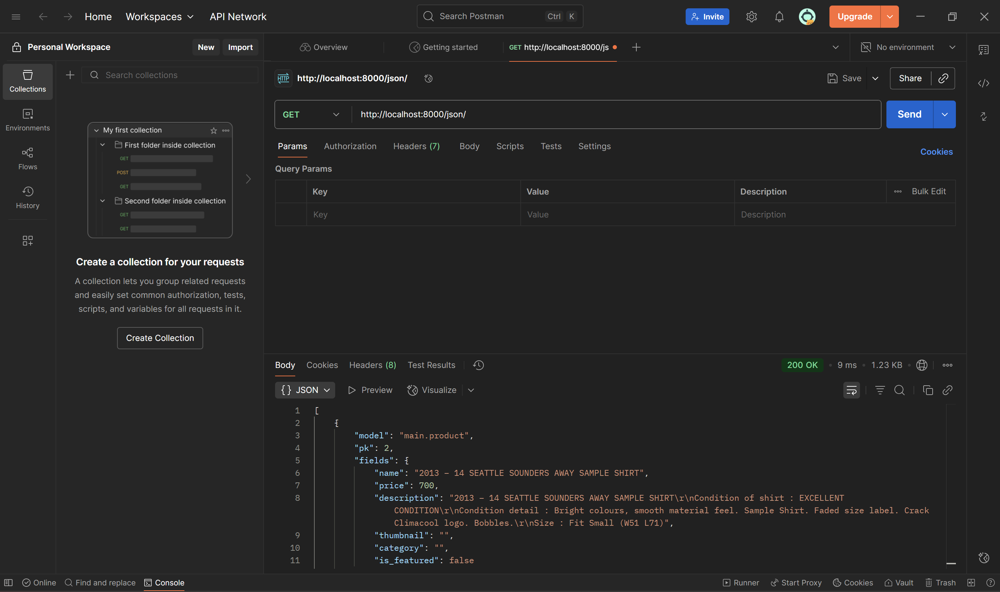
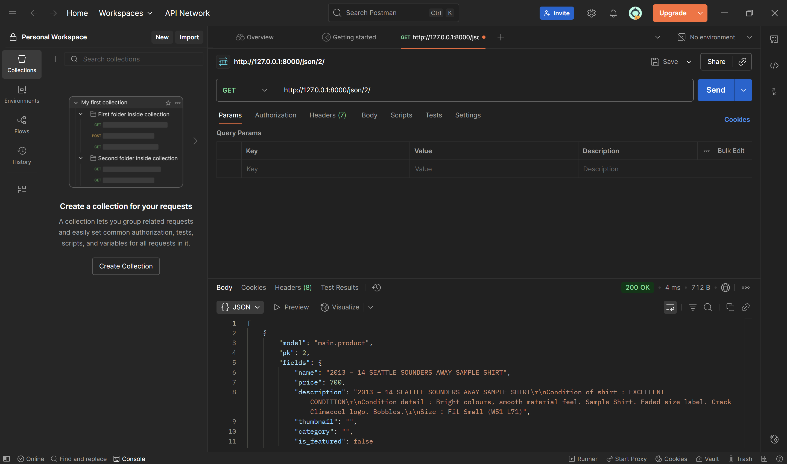

# Tugas 2
## Identitas
- Nama: Khalisa Adzkiyah  
- NPM: 2406418995  
- Kelas: A  


## Link PWS
[https://khalisa-adzkiyah-footballshop.pbp.cs.ui.ac.id/](https://khalisa-adzkiyah-footballshop.pbp.cs.ui.ac.id/)


## Cara Menjalankan (Lokal)
1. `python -m venv env`
2. `.\env\Scripts\Activate.ps1`
3. `pip install -r requirements.txt`
4. `python manage.py migrate`
5. `python manage.py runserver`
6. Buka [http://127.0.0.1:8000/](http://127.0.0.1:8000/)


## Implementasi (Step-by-Step)
1. Membuat project Django `football-shop` dengan `django-admin startproject football-shop .`
2. Membuat aplikasi `main` dengan `python manage.py startapp main` dan mendaftarkannya di `INSTALLED_APPS`
3. Mendefinisikan model `Product` di `main/models.py` dengan field:
   - `name`, `price`, `description`, `thumbnail`, `category`, `is_featured`
4. Menjalankan `makemigrations` dan `migrate`
5. Register model di `main/admin.py`
6. Membuat view `show_main` di `main/views.py` dan template `main/templates/main/main.html`
7. Membuat `main/urls.py`, lalu include ke `football_shop/urls.py`
8. Menambahkan files untuk deploy (`requirements.txt`, `.env.prod`), commit & push, lalu deploy ke PWS


## Bagan Request–Response
Client (browser) -> `football_shop/urls.py` -> include(`main.urls`) -> `main/urls.py` -> `views.show_main` ->
query ke `Product` model (`models.py`) -> render `main/templates/main/main.html` -> response HTML → Client  


**Kaitan file**:
- `urls.py` -> menerima request & arahkan ke view
- `views.py` -> ambil data dari model & render template
- `models.py` -> definisi struktur data (ORM)
- `settings.py` -> konfigurasi global (DB, ALLOWED_HOSTS, static, dll)


## Peran settings.py
File konfigurasi utama: menyimpan `INSTALLED_APPS`, database, flag `DEBUG/PRODUCTION`, `ALLOWED_HOSTS`, static files, SECRET_KEY, dsb.


## Cara Kerja Migrasi
- `makemigrations` -> membuat file migration berdasarkan perubahan di model
- `migrate` -> menerapkan perubahan schema ke database (buat/ubah tabel)


## Kenapa Django Diajarkan Awal
- "Batteries-included" -> banyak fitur bawaan (ORM, admin, auth)
- Struktur MVT jelas -> memisahkan logic, data, dan UI
- Dokumentasi lengkap & banyak contoh -> cocok untuk pemula


## Feedback untuk Asdos
Tutorial jelas dan membantu.


# Tugas 3


## 1. Mengapa kita memerlukan data delivery?
Data delivery diperlukan agar backend dapat mengirimkan data ke konsumen (frontend, mobile app, service lain) dalam format yang terstruktur dan dapat di-parse (mis. JSON, XML). Manfaatnya:
- **Interoperabilitas**: berbagai client / language dapat mengonsumsi data yang sama.  
- **Decoupling**: frontend dan backend bisa dikembangkan terpisah.  
- **Automasi & integrasi**: microservice, webhook, atau sistem pihak ketiga dapat mengakses data secara otomatis.  
- **Efisiensi**: format seperti JSON biasanya lebih ringkas sehingga mengurangi latensi / ukuran payload.


## 2. XML vs JSON, mana yang lebih baik? Mengapa JSON lebih populer dibandingkan XML?
- **JSON** lebih populer untuk web API modern karena:
  - Sintaks lebih ringkas (less verbose) -> bandwidth lebih hemat.
  - Native di JavaScript -> parsing/serialisasi mudah (`JSON.parse` / `JSON.stringify`).
  - Umumnya lebih cepat dan lebih sederhana untuk dipakai di REST API.
- **XML** masih berguna jika butuh fitur-fitur tertentu seperti namespace, XSD/schema validation, transformasi XSLT, atau kompatibilitas dengan sistem lama (legacy).
- **Kesimpulan**: untuk kebanyakan aplikasi web/mobile saat ini JSON lebih praktis, pilih XML hanya bila butuh fitur spesifik XML.


## 3. Fungsi `is_valid()` pada Django Form dan mengapa diperlukan
- `form.is_valid()` menjalankan validasi semua field, memanggil `clean_field()` dan `clean()` (jika ada), serta validator field.  
- Jika `is_valid()` mengembalikan `True`, data aman diakses lewat `form.cleaned_data`. Jika `False`, `form.errors` berisi pesan error.  
- **Kenapa penting**: mencegah data invalid/berbahaya tersimpan ke database, memastikan integritas data sebelum `form.save()` atau operasi lain.


Contoh pemakaian:
```python
form = ProductForm(request.POST)
if form.is_valid():
    form.save()
else:
    # tampilkan form.errors ke user
```

# 4. Mengapa perlu csrf_token di form Django? Risiko jika tidak ada?
- csrf_token mencegah Cross-Site Request Forgery (CSRF): serangan yang memaksa browser user (yang sudah login) mengirim request (biasanya POST) ke situs kita melalui halaman jahat.
- Tanpa CSRF protection, penyerang bisa membuat form di situs lain yang mengirim POST ke endpoint internal (mis. hapus/ubah data) atas nama user yang sedang login.
- csrf_token memastikan request POST berasal dari template/form yang valid dari domain kita — server memverifikasi token tersebut.
- Contoh:
<form method="POST">
  
  <!-- fields -->
</form>

# 5. Langkah implementasi checklist (step-by-step, bukan sekadar copi dari tutorial)
1. **Menambahkan 4 fungsi views baru**  
   - `show_xml`, `show_json`, `show_xml_by_id`, dan `show_json_by_id` ditambahkan pada `views.py` menggunakan `serializers.serialize()`.

2. **Membuat routing URL untuk tiap view**  
   - Menambahkan path baru di `main/urls.py` untuk mengakses masing-masing fungsi (`/xml/`, `/json/`, `/xml/<id>/`, `/json/<id>/`).

3. **Membuat halaman list produk (main.html)**  
   - Menampilkan semua objek `Product`.
   - Ditambahkan tombol **Add** yang mengarah ke form tambah produk.
   - Ditambahkan tombol **Detail** di tiap produk untuk melihat detail.

4. **Membuat halaman form tambah produk**  
   - Membuat `forms.py` dengan `ProductForm` (berbasis `ModelForm`).
   - Membuat view `add_product` untuk menampilkan form dan menyimpan data jika valid.
   - Membuat template `add_product.html` berisi form dengan ``.

5. **Membuat halaman detail produk**  
   - View `product_detail` menampilkan detail produk berdasarkan ID.
   - Template `product_detail.html` dibuat untuk menampilkan informasi detail produk.

## Hasil Pengujian dengan Postman

### 1. Endpoint XML (All Objects)


### 2. Endpoint JSON (All Objects)


### 3. Endpoint XML by ID


### 4. Endpoint JSON by ID


### Feedback untuk Asdos
Tutorial 2 sudah jelas dan membantu memahami konsep dasar. 

# Tugas 4

## 1. Apa itu Django AuthenticationForm?
`AuthenticationForm` adalah form bawaan Django untuk proses login. Form ini otomatis menyediakan field `username` dan `password`, serta melakukan validasi dengan sistem autentikasi Django.
**Kelebihan**:
- Tidak perlu membuat form login dari nol.
- Sudah terhubung dengan sistem autentikasi Django (cek password hash, validasi user aktif, dll).
- Lebih aman karena Django sudah menyediakan proteksi standar.
**Kekurangan**:
- Kurang fleksibel untuk kustomisasi UI/UX.
- Jika ingin menambahkan field tambahan (misalnya login dengan email), harus override form.

# 2. Perbedaan Autentikasi dan Otorisasi
**Autentikasi** -> proses verifikasi identitas pengguna (contoh: login dengan username dan password).
**Otorisasi** -> proses verifikasi hak akses pengguna (contoh: hanya admin bisa hapus data).
**Implementasi di Django**:
- Autentikasi: handled oleh `django.contrib.auth` (fungsi `authenticate()`, `login()`, `logout()`).
- Otorisasi: handled lewat `permissions`, `groups`, dan `decorator` seperti `@login_required` atau `@permission_required`.

## 3. Kelebihan dan Kekurangan Session dan Cookies
**Session**:
- Kelebihan: aman karena data disimpan di server, hanya session ID di browser.
- Kekurangan: butuh resource server lebih besar, data bisa hilang jika session expired.
**Cookies**:
- Kelebihan: ringan, data disimpan di browser, bisa dipakai lintas sesi (persistent cookie).
- Kekurangan: kurang aman, karena data tersimpan di client bisa dimanipulasi.

## 4. Apakah cookies aman secara default?
**Tidak sepenuhnya aman**. Cookies bisa dicuri (misalnya lewat serangan XSS) atau dimanipulasi.
**Risiko**: pencurian identitas, session hijacking, pelacakan pengguna.
**Django handling**:
- Cookies penting (misalnya sessionid, csrftoken) otomatis diberi proteksi dengan atribut `HttpOnly`, `Secure`, dan `SameSite`.
- Ada middleware bawaan `CsrfViewMiddleware` untuk melindungi dari CSRF.

## 5. Step-by-step Implementasi Checklist
1. **Registrasi, login, logout**
- Menambah fungsi `register`, `login_user`, `logout_user` di `views.py`.
- Membuat template `register.html` dan `login.html`.
- Memakai `UserCreationForm` dan `AuthenticationForm`.
2. **Membuat 2 akun + 3 dummy data tiap akun**
- Menjalankan `python manage.py createsuperuser` atau register via halaman web.
- Masukkan dummy data ke model `Product` melalui form/tambah manual di admin.
3. **Menghubungkan model Product dengan User**
- Menambahkan field `user = models.ForeignKey(User, on_delete=models.CASCADE)` pada model `Product`.
- Saat menyimpan produk baru, isi `product.user = request.user`.
4. **Menampilkan informasi pengguna + last_login**
- Pada view `show_main`, ambil `request.user.username`.
- Simpan `last_login` di cookies saat login:
```python
response.set_cookie('last_login', str(datetime.datetime.now()))
```
- Menampilkan di template `main.html`.
5. **Push ke GitHub**
Menjalankan `git add .`, `git commit -m "Tugas 4 selesai"`, `git push origin main`.

# Tugas 5

# 1. Jika terdapat beberapa CSS selector untuk suatu elemen HTML, jelaskan urutan prioritas pengambilan CSS selector tersebut
Urutan prioritas (dari yang paling kuat ke lemah):
1. **Origin & Importance**
- `!important`dari author > `!important` dari user > style biasa.
- Penjelasan: aturan dengan `!important` akan meng-override aturan lain kecuali ada `!important` dengan origin yang lebih tinggi.
2. **Specificity (Kekhususan selector)**
- Inline style (mis. `style="..."`) -> paling tinggi.
- ID selector (`#id`) -> tinggi.
- Class / attribute / pseudo-class (`.class`, `[attr]`, `:hover`) -> sedang.
- Element / pseudo-element (`div`, `p`, `::after`) -> rendah.
3. **Order of appearance (urutan sumber/penulisan)**
- Jika specificity sama, maka yang muncul belakangan (terakhir dimuat) yang berlaku.
- Contoh: dua file CSS: `styles1.css` lalu `styles2.css` — aturan di `styles2.css` akan menang bila equal specificity.
4. **Initial & inherited properties**
Properti yang diwariskan (mis. color, font-family) bisa diwarisi dari parent jika tidak ditentukan pada element.
Contoh:
```python
<h1 id="title" class="big" style="color: red;">Judul</h1>
```
Aturan `style="color: red;"` (inline) akan menang atas `#title { color: aqua; }` dan `.big { color: cadetblue; }` dan `h1 { color: blue; }`.

# 2. Mengapa responsive design penting? Berikan contoh aplikasi yang sudah dan belum menerapkan responsive design, serta jelaskan mengapa
**Mengapa penting:**
- Pengguna mengakses web dari berbagai perangkat (hp, tablet, desktop). Responsive memastikan UI tetap usable dan accessible.
- Meningkatkan pengalaman pengguna (UX) dan menurunkan bounce rate.
- Baik untuk SEO: mesin pencari memprioritaskan mobile-friendly sites.
- Hemat biaya: satu basis kode untuk berbagai ukuran layar.
**Contoh aplikasi yang sudah menerapkan responsive design:**
- Google Search / Google Maps - antarmuka menyesuaikan layout dan fitur (hamburger menu, responsive map controls).
- Bootstrap-based sites - menggunakan grid system dan utility class untuk mobile-first.
**Contoh aplikasi yang kurang/kurang baik menerapkan responsive design:**
Situs lama yang dibuat khusus untuk desktop (mis. beberapa portal berita jadul atau intranet perusahaan lama) biasanya menampilkan layout kaku, font kecil, dan butuh scroll horizontal di mobile.
**Kenapa perbedaan terjadi:**
Situs modern dirancang mobile-first dan memakai media queries, unit responsif (%, rem, vw) serta framework. Situs lama sering mengandalkan fixed widths (px), layout tabel, dan tidak diuji di perangkat lain.

# 3. Perbedaan antara margin, border, dan padding, serta cara mengimplementasikannya
- **Margin**: ruang di luar border elemen — memisahkan elemen dengan elemen lain.
- **Border**: garis pinggir di sekitar elemen (terletak di antara padding dan margin).
- **Padding**: ruang di dalam border — memisahkan isi (content) dari border.
**Box model**: `margin` -> `border` -> `padding` -> `content`.
**Praktik implementasi (CSS)**:
```python
/* Menggunakan box-sizing: border-box untuk membuat perhitungan ukuran lebih intuitif */
* { box-sizing: border-box; }

.card {
margin: 1rem;  /* jarak antar elemen */
border: 1px solid #ccc; /* garis pinggir */
padding: 1rem; /* jarak isi terhadap border */
}
```
Gunakan satuan relatif (`rem`, `%`, `vw`) agar lebih responsif.

# 4. Konsep Flexbox dan Grid Layout beserta kegunaannya
**Flexbox (Flexible Box Layout)**
- Fokus pada one-dimensional layout (baris `atau` kolom).
- Bagus untuk: navbar, card rows, align item center, distribusi ruang antar item.
- Properti penting: `display: flex;`, `flex-direction`, `justify-content`, `align-items`, `flex-wrap`, `gap`, `flex` (shorthand untuk `flex-grow`, `flex-shrink`, `flex-basis`).
**Contoh**:
```python
.container { display: flex; gap: 1rem; align-items: center; }
.item { flex: 1; }
```
**Grid Layout**
- Fokus pada two-dimensional layout (baris `dan` kolom).
- Cocok untuk layout halaman lengkap: header, sidebar, main, footer; atau galeri foto.
- Properti penting: `display: grid;`, `grid-template-columns`, `grid-template-rows`, `grid-gap`/`gap`, `grid-area`, `auto-fit`/`auto-fill` dengan `minmax()`.
**Contoh**:
```python
.grid { display: grid; grid-template-columns: repeat(3, 1fr); gap: 1rem; }
```
**Kapan pakai apa?**
- Menggunakan `Flexbox` untuk komponen baris/kolom dan alignment internal.
- Menggunakan `Grid` untuk layout halaman yang kompleks dan pengaturan area besar.
- Keduanya sering dipadukan - Grid untuk layout utama, Flexbox untuk konten dalam area grid.

# 5. Cara saya mengerjakan checklist tugas ini
1. Menambahkan fitur edit dan delete product di views dan urls, lalu memastikan hanya pemilik product yang bisa mengubah atau menghapus.
2. Mengubah desain halaman login, register, tambah product, edit product, dan detail product supaya lebih menarik dengan CSS/Framework.
3. membuat halaman daftar product jadi lebih menarik: kalau kosong muncul gambar + pesan, kalau ada product muncul dalam bentuk card dengan tombol Edit dan Delete.
4. membuat navbar yang responsif: di layar besar tampil penuh, di layar kecil berubah jadi tombol hamburger.
5. lakukan pengecekan di browser (mobile dan desktop) untuk memastikan semuanya berjalan dengan baik, lalu commit dan push ke GitHub.